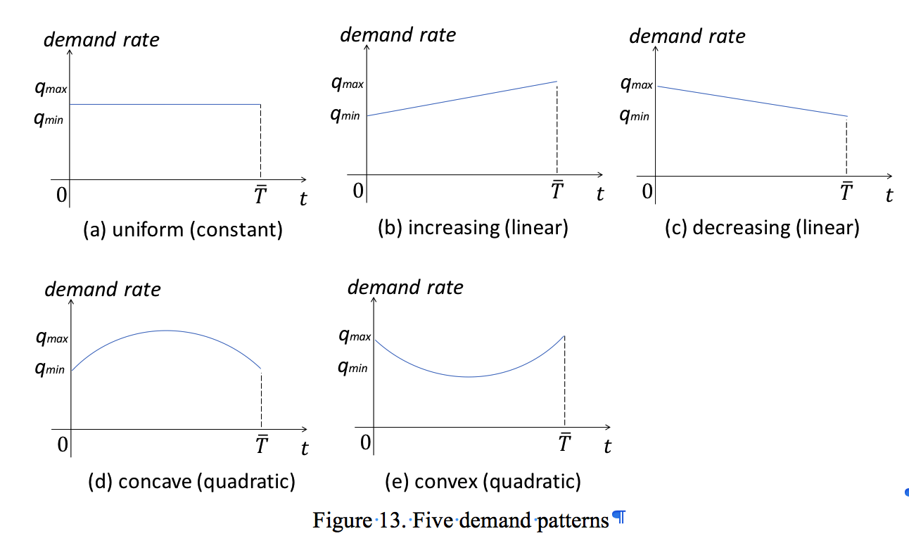
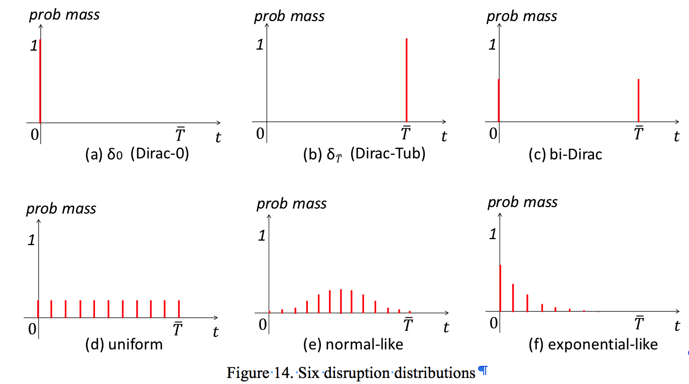

# transit-disruption-mitigation
## Description
An algorithm for transit disruption mitigation - strategy seletion phase (resource allocation)[^1]

[^1]: some of the code is designed specificaly for example 1; changes are needed if you want to apply it to other networks!

## Usage
Run <i>main.py [Q_scenario] [q_0] [q_max] [T_scenario] [alpha]</i>  
@args Q_scenario: the name of demand pattern  
@args q_0, q_max: specification the level of demand, like "uniform", "convex", "concave", "increasing", "decreasing"  
@args T_scenario: the name of the disruption distribution, like "uniform", "exponential", "normal", "Dirac_0", "Dirac_Tub", "bi_Dirac"  

demand pattern illustration:  
 

disruption distribution illustration:  
 

## Components
The evaluation module takes time-dependent demand, disruption distribution, and mitigation plans as input, and outputs the user and operator cost in the horizon. Time is discretized into one minute intervals when accumulating the user costs. The user demands in each one-minute interval are assigned according to the capacity constraints at that time. Not enough capacity on the shortest
path means that users will detour to longer distance paths. User wait cost depends on average headway.

 

User cost computation:

 

## Contributors
Qi Liu(ql375@nyu.edu), Joseph Chow(joseph.chow@nyu.edu)
